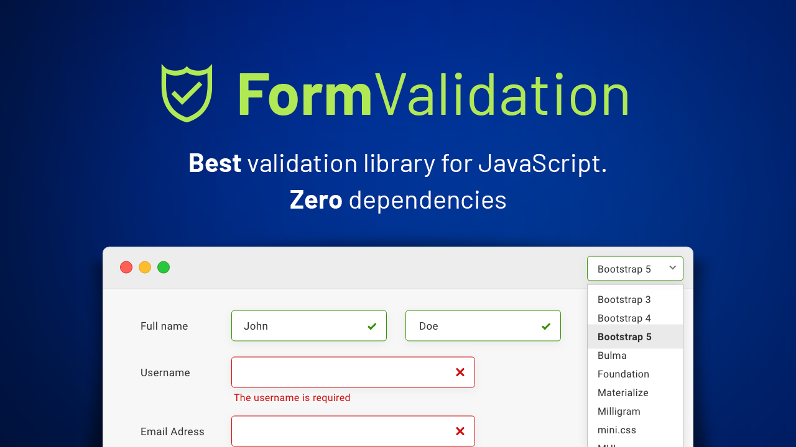

/*
 * This file is part of the project by AGBOKOUDJO Franck.
 *
 * (c) AGBOKOUDJO Franck <internationaleswebservices@gmail.com>
 * Phone: +229 0167 25 18 86
 * LinkedIn: https://www.linkedin.com/in/internationales-web-apps-services-120520193/
 * Company: INTERNATIONALES WEB APPS & SERVICES
 *
 * For more information, please feel free to contact the author.
 */

# 📚 Form Validator Documentation @wlindabla/form_validator

## 🛡️ Robust and Modern Form Validation Library

**`@wlindabla/form_validator`** is a powerful, architectural JavaScript/TypeScript library designed to streamline and centralize the tedious process of validating HTML forms. Built on a clean **Adapter Pattern** and leveraging the safety of TypeScript, it ensures reliable and maintainable validation logic across your applications.

The library supports a wide range of input types, from standard text, email, password, and number fields to complex media types like `images`, `videos`, and `documents`.

### ✨ Key Features

* **Centralized Validation Logic:** All validation rules are managed by a central `FormValidateController`, simplifying code maintenance.
* **Decoupled Architecture:** Utilizes the Adapter pattern (`FieldInputController`) to decouple DOM interaction from validation logic, making it highly testable.
* **Router-Based Validation:** A dedicated `FormInputController` acts as a router, dispatching validation tasks to specific, highly specialized validators (e.g., `PasswordInputValidator`, `UrlInputValidator`).
* **Performance Caching (v2.2.0):** Introduces a pluggable cache architecture (using `FieldOptionsValidateCacheAdapterInterface` and `LocalStorageCacheAdapter`) to significantly speed up repeated validation checks by minimizing DOM lookups.
* **HTTP Handler:** Includes a powerful `httpFetchHandler` function to standardize and centralize form data submission and error handling.
* **Future-Proof & Compatible:** While using jQuery internally for maximum cross-browser compatibility and event delegation, the core logic is separate, allowing for **seamless integration into modern frameworks** like ReactJS, Angular, and VueJS.

### 🌐 Isomorphic Ready (Front-end & Back-end)

The library's design makes it ideal for isomorphic applications:

* **Logic Reuse:** Core validators (e.g., `Text`, `Number`, `Email`) can be reused directly in **Node.js** environments for server-side validation, ensuring data integrity parity.
* **Custom Adaptability:** Developers are encouraged to implement a custom **Node.js Adapter** (similar to the Front-end's `FieldInputController`) to handle server-side data formats (e.g., file streams or JSON payloads), fully leveraging the robust validation rules on the server.

### ⬇️ Installation

You can install the library using npm or yarn:

```bash
# Using npm
npm install @wlindabla/form_validator

# Using yarn
yarn add @wlindabla/form_validator
```

  ## Collection
  - [index](./docs/Collection/index.md)

  ## FormFormattingEvent
  - [index](./docs/FormFormattingEvent/index.md)

  ## _Utils 
  - [api](./docs/_Utils/api.md)
  - [Exception](./docs/_Utils/Exception.md)
  - [form](./docs/_Utils/form.md)
  - [http](./docs/_Utils/http.md)
  - [logger](./docs/_Utils/logger.md)
  - [merge](./docs/_Utils/merge.md)
  - [string](./docs/_Utils/string.md)
  - [translate](./docs/_Utils/translate.md)
  - [getMetaContent](./docs/_Utils/Dom/getMetaContent.md)
  
  ## Translation
  - [AppTranslation](./docs/Translation/AppTranslation.md)
  - [Cache](./docs/Translation/cache.md)
  - [FetchErrorTranslator](./docs/Translation/FetchErrorTranslator.md)
  
  ## Toggle User Account
  - [ToggleAccountListener](./docs/User/listener_toggle_user.md)
  - [ToggleUserAccount](./docs/User/toggle_user_account.md)
  
  ## Validators
  - [index](./docs/Validators/index.md)
