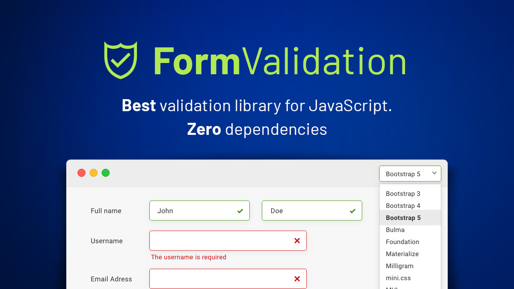

/*
 * This file is part of the project by AGBOKOUDJO Franck.
 *
 * (c) AGBOKOUDJO Franck <internationaleswebservices@gmail.com>
 * Phone: +229 0167 25 18 86
 * LinkedIn: https://www.linkedin.com/in/internationales-web-apps-services-120520193/
 * Company: INTERNATIONALES WEB APPS & SERVICES
 *
 * For more information, please feel free to contact the author.
 */

# 📚 Form Validator Documentation @wlindabla/form_validator

## 🛡️ Robust and Modern Form Validation Library

**`@wlindabla/form_validator`** is a powerful, architectural JavaScript/TypeScript library designed to streamline and centralize the tedious process of validating HTML forms. Built on a clean **Adapter Pattern** and leveraging the safety of TypeScript, it ensures reliable and maintainable validation logic across your applications.

The library supports a wide range of input types, from standard text, email, password, and number fields to complex media types like `images`, `videos`, and `documents`.

### ✨ Key Features

* **Centralized Validation Logic:** All validation rules are managed by a central `FormValidateController`, simplifying code maintenance.
* **Decoupled Architecture:** Utilizes the Adapter pattern (`FieldInputController`) to decouple DOM interaction from validation logic, making it highly testable.
* **Router-Based Validation:** A dedicated `FormInputController` acts as a router, dispatching validation tasks to specific, highly specialized validators (e.g., `PasswordInputValidator`, `UrlInputValidator`).
* **Performance Caching (v2.2.0):** Introduces a pluggable cache architecture (using `FieldOptionsValidateCacheAdapterInterface` and `LocalStorageCacheAdapter`) to significantly speed up repeated validation checks by minimizing DOM lookups.
* **HTTP Handler:** Includes a powerful `httpFetchHandler` function to standardize and centralize form data submission and error handling.
* **Future-Proof & Compatible:** While using jQuery internally for maximum cross-browser compatibility and event delegation, the core logic is separate, allowing for **seamless integration into modern frameworks** like ReactJS, Angular, and VueJS.

### 🌐 Isomorphic Ready (Front-end & Back-end)

The library's design makes it ideal for isomorphic applications:

* **Logic Reuse:** Core validators (e.g., `Text`, `Number`, `Email`) can be reused directly in **Node.js** environments for server-side validation, ensuring data integrity parity.
* **Custom Adaptability:** Developers are encouraged to implement a custom **Node.js Adapter** (similar to the Front-end's `FieldInputController`) to handle server-side data formats (e.g., file streams or JSON payloads), fully leveraging the robust validation rules on the server.

### ⬇️ Installation

You can install the library using npm or yarn:

```bash
# Using npm
npm install @wlindabla/form_validator

# Using yarn
yarn add @wlindabla/form_validator
```

  ## Collection
`SymfonyFieldCollectionManager` is a TypeScript/JavaScript class that **automates the management of dynamic form field collections** in Symfony applications.
It is specifically designed to work with [Symfony's `CollectionType`](https://symfony.com/doc/current/reference/forms/types/collection.html) form field, which exposes an HTML `data-prototype` attribute to allow JavaScript to clone and inject new form rows dynamically.
  - [Collection](./docs/Collection/index.md)

  ## @wlindabla/form_validator - FormFormattingEvent API Documentation

  `FormFormattingEvent` is a singleton class from the **@wlindabla/form_validator** library that provides real-time formatting and validation utilities for form input fields. It handles automatic transformation of user input including uppercase conversion, word capitalization, and comprehensive username formatting with locale support.
  - [FormFormattingEvent](./docs/FormFormattingEvent/index.md)

  ## _Utils 
  - [api](./docs/_Utils/api.md)
  - [Exception](./docs/_Utils/Exception.md)
  
  ## DOM Error Handling & Form Utilities Module
This module provides a complete **DOM-side error management system** for HTML forms. It handles:
- Generating accessible, styled error message HTML elements
- Appending, updating, and clearing validation errors in the DOM
- Managing submit button states during form submission
- Extracting and compiling `pattern` attributes from inputs into `RegExp` objects
- Handling server-side or client-side validation error objects for complex, multi-field forms
All utilities are **framework-agnostic** and work anywhere JavaScript runs in a browser.
**Part of the `@wlindabla/form_validator` library** — A powerful JavaScript/TypeScript library for validating HTML form fields: `text`, `email`, `tel`, `password`, `image`, `PDF`, `Word`, `CSV`, `Excel`, and more.
  - [DOM-side error management system](./docs/_Utils/form.md)
  
  ## FormSubmission
  `FormSubmission` is a powerful module included in `@wlindabla/form_validator` that handles the **complete lifecycle of an HTML form submission** via the Fetch API.

  It provides out of the box:

  - A **state machine** to track every step of the submission process
  - A **typed event system** that lets you hook into each lifecycle phase
  - **Automatic server-side field error handling** (e.g. Symfony validation errors)
  - A **confirmation gate** before any request is fired
  - A **delegation system** for custom navigation/redirect logic
  - Full **TypeScript support**
  -[FormSubmission](./docs/form_submission/formSubmission.md)

  ### Features

  ## Logger Utility - Complete Documentation
  
  The **Logger** class is a singleton-based logging utility designed for TypeScript applications. It provides environment-aware, formatted console logging with color-coded output, automatic timestamps, and type-safe error handling.

  ### Key Features

  - **Singleton Pattern**: Ensures a single Logger instance throughout the application lifecycle
  - **Environment-Aware**: Different logging behaviors for `dev`, `prod`, and `test` environments
  - **Color-Coded Output**: Distinct colors for different log levels (log, info, warn, error)
  - **Automatic Timestamps**: ISO 8601 format timestamps on every log entry
  - **Smart Formatting**: Intelligent handling of Errors, objects, and primitive values
  - **Production-Safe**: Respects DEBUG flag and environment settings
  - [logger](./docs/_Utils/logger.md)
  
  ## Merge
  The **Deep Merge Utility Library** provides robust, type-safe solutions for merging complex JavaScript objects and arrays in TypeScript applications. Whether you're working with configuration files, API responses, user preferences, or nested data structures, this library offers flexible and powerful merging capabilities with full TypeScript support.

  ### Use Cases

  - **Configuration Management**: Merge default settings with user configurations
  - **API Response Handling**: Combine multiple API responses intelligently
  - **State Management**: Merge application state across different modules
  - **Settings Aggregation**: Layer multiple configuration sources (system, user, admin)
  - **Data Synchronization**: Merge datasets from different sources
  - [merge](./docs/_Utils/merge.md)
  
  ## String Function
  **A Comprehensive Utility Library for String Validation and Text Manipulation**

  Professional-grade string validation, formatting, and analysis tools designed for modern frontend applications.
  `@wlindabla/form_validator` is a production-ready utility library designed to handle common frontend validation and string manipulation tasks. It provides robust tools for:
- **Security**: HTML escaping and XSS prevention
- **Formatting**: Professional string capitalization and username formatting
- **Analysis**: Character-level analysis and word complexity scoring
- **Validation**: Byte-length validation, type checking, and content analysis
  - [string](./docs/_Utils/string.md)
  
  ## getMetaContent - Meta Tag Utility Library

  A professional TypeScript utility library for retrieving and parsing HTML meta tag content with maximum browser compatibility (IE8+). Built with jQuery for legacy browser support.
  - [getMetaContent](./docs/_Utils/Dom/getMetaContent.md)
  
  ## Translation
  ### AppTranslation - Application Translation Manager
  Enterprise-grade translation management system with intelligent caching, meta tag integration, and multi-framework support. Perfect for Symfony Sonata Admin and modern web applications.
  - [AppTranslation](./docs/Translation/AppTranslation.md)
  
  ### Translation Cache System
  Professional client-side caching system for managing translation messages with support for multiple storage adapters. Designed for modern web applications that need efficient i18n caching.

  **Perfect for:** Symfony Sonata Admin, React, Vue.js, Angular, and any framework requiring translation caching.
  - [Cache](./docs/Translation/cache.md)
  
 

  ## CRUD Action 

  **@wlindabla/form_validator** is a powerful, **framework-agnostic** library for managing CRUD (Create, Read, Update, Delete) actions in modern web applications and admin dashboards (SonataAdminBundle, EasyAdmin, Django, etc.).

  ### Why use this library?

  🚀 **Lightning-fast implementation** - Confirmation dialogs, HTTP requests, and callbacks in one function call  
  🎯 **Framework-agnostic** - Works seamlessly with React, Vue, Angular, jQuery, or vanilla JS  
  🛡️ **Bulletproof error handling** - Built-in retry logic, network error handling, and user feedback  
  ♿ **Legacy support** - IE8+ compatibility via jQuery  
  🎨 **Fully customizable** - Custom dialogs, headers, callbacks, and event names  
  ⚡ **Production-ready** - Used in enterprise applications handling thousands of transactions daily
  - [CRUDAction](./docs/User/action_and_listener.md)
  
  ## Form Validators 
  The **Form Validator Library** is a centralized form error state management solution designed to provide a Single Source of Truth for form validation across your application. This library implements the Singleton pattern to ensure consistent form state management throughout your project.
  Built with TypeScript, it offers type-safe error tracking, field validity management, and intuitive chainable methods for seamless integration into modern web applications.
  A comprehensive form validation library for HTML forms supporting `text`, `email`, `tel`, `password`, `URL`, `date`, `number`, `select`, `checkbox`, `radio`,`fqdn`, and enriched file types: **images**, **PDFs**, **Word documents**, **Excel**, **CSV**, **ODF/RTF**, and **videos** — with binary signature inspection (magic bytes), real metadata validation, and a centralized error store.
  - [Documentation](./docs/Validators/index.md)
  